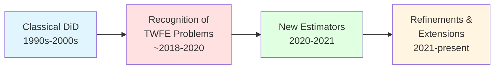

# Understanding the Difference-in-Differences Literature: A Comprehensive Guide

## Overview

This guide provides a structured approach to understanding the methodological literature on Difference-in-Differences (DiD) estimation. Based on your collection of 27 papers, I've organized them into thematic categories and provided a roadmap for understanding this evolving field.

---

## Table of Contents

1. [What is Difference-in-Differences?](#what-is-difference-in-differences)
2. [Key Methodological Challenges](#key-methodological-challenges)
3. [Paper Organization by Theme](#paper-organization-by-theme)
4. [Recommended Reading Paths](#recommended-reading-paths)
5. [Detailed Paper Guide](#detailed-paper-guide)

---

## What is Difference-in-Differences?

**Difference-in-Differences (DiD)** is a quasi-experimental research design used to estimate causal effects by comparing the changes in outcomes over time between a treatment group and a control group.

### Core Concept

- **First difference**: Change over time in the treatment group
- **Second difference**: Removes the change over time in the control group
- **Key assumption**: **Parallel Trends** - absent treatment, both groups would have followed parallel paths

### Basic Setup

```
DiD Estimator = (Y_treated,post - Y_treated,pre) - (Y_control,post - Y_control,pre)
```

---

## Key Methodological Challenges

Your collection addresses several critical challenges that have emerged in DiD research:

### 1. **Two-Way Fixed Effects (TWFE) with Heterogeneous Treatment Effects**

- **Problem**: Standard TWFE estimators can produce misleading results when treatment effects vary across units or time
- **"Forbidden comparisons"**: Already-treated units used as controls for newly-treated units
- **Negative weights problem**: Some comparisons receive negative weights, potentially reversing signs

### 2. **Staggered Adoption Designs**

- **Problem**: When different units are treated at different times, traditional DiD becomes complex
- **Challenge**: How to aggregate information across multiple treatment timing cohorts

### 3. **Parallel Trends Assumption**

- **Problem**: The key identifying assumption is untestable (requires knowing counterfactual trends)
- **Solutions**: Pre-trends testing, sensitivity analysis, honest inference

### 4. **Synthetic Control Integration**

- **Innovation**: Combining synthetic control methods with DiD for better control group construction

---

## Paper Organization by Theme

### 📚 Foundational and Classical DiD

**NBER Working Paper t0280.pdf** & **NBER Working Paper t0312.pdf**

- Classical treatments of DiD methodology
- Historical foundations

**NBER Working Paper 8841.pdf**

- Early methodological development

---

### 🔥 Two-Way Fixed Effects Revolution (Critical Reading)

**[de-chaisemartin-d-haultf_C5_93uille-2020-two-way-fixed-effects-estimators-with-heterogeneous-treatment-effects.pdf](file:///home/simon/githubRepos/DrSnow/didMethodPapers/Methodological%20papers%20on%20DiD/de-chaisemartin-d-haultf_C5_93uille-2020-two-way-fixed-effects-estimators-with-heterogeneous-treatment-effects.pdf)**

- **Authors**: Clément de Chaisemartin & Xavier D'Haultfœuille
- **Key contribution**: Shows that TWFE estimators can be biased under heterogeneous treatment effects
- **Impact**: One of the most influential recent papers in applied econometrics
- **Why read**: Essential for understanding why modern DiD methods have evolved

**1-s2.0-S0304407620303948-main.pdf** (likely related to TWFE issues)
**1-s2.0-S0304407621001445-main.pdf** (Journal of Econometrics article)

**Related NBER Papers**:

- **NBER Working Paper 24963.pdf**
- **NBER Working Paper 25018.pdf**
- **NBER Working Paper w22791.pdf**

---

### 🎯 Staggered Adoption and Event Studies

**[div-class-title-using-multiple-pretreatment-periods-to-improve-difference-in-differences-and-staggered-adoption-designs-div.pdf](file:///home/simon/githubRepos/DrSnow/didMethodPapers/Methodological%20papers%20on%20DiD/div-class-title-using-multiple-pretreatment-periods-to-improve-difference-in-differences-and-staggered-adoption-designs-div.pdf)**

- **Key contribution**: Leveraging pre-treatment variation for improved estimation
- **Relevance**: Common in real-world applications where treatment timing varies

**NBER Working Paper 245.pdf**
**NBER Working Paper 29691.pdf**
**NBER Working Paper 31063.pdf**
**NBER Working Paper 31842.pdf**

---

### 🔬 Synthetic Difference-in-Differences

**[arkhangelsky-et-al-2021-synthetic-difference-in-differences.pdf](file:///home/simon/githubRepos/DrSnow/didMethodPapers/Methodological%20papers%20on%20DiD/arkhangelsky-et-al-2021-synthetic-difference-in-differences.pdf)**

- **Authors**: Arkhangelsky, Athey, Hirshberg, Imbens, Wager
- **Key contribution**: Combines synthetic control methods with DiD
- **Method**: Uses pre-treatment fit to construct better control groups
- **Why read**: Major methodological innovation combining two powerful approaches

**Related**:

- **1804.05785v2.pdf** (likely arXiv version)

---

### 📊 Parallel Trends and Identification

**[Honest Parallel Trends July 2021.pdf](file:///home/simon/githubRepos/DrSnow/didMethodPapers/Methodological%20papers%20on%20DiD/Honest%20Parallel%20Trends%20July%202021.pdf)**

- **Key contribution**: Sensitivity analysis for parallel trends violations
- **Method**: Allows researchers to assess robustness to deviations from parallel trends
- **Why read**: Addresses the fundamental untestable assumption in DiD

**rdae007.pdf** (likely Review of Economic Studies or similar)

**NBER Working Paper 29873.pdf**
**NBER Working Paper 30564.pdf**

---

### 🆕 Recent Innovations and Extensions

**arXiv 1808.05293.pdf**
**arXiv 2201.01194.pdf**
**arXiv 2503.13323.pdf**

- Recent methodological developments from the statistics/econometrics community

**NBER Working Paper w31184.pdf**
**NBER Working Paper w32054.pdf**
**NBER Working Paper w32117.pdf**
**NBER Working Paper w33026.pdf**

- Cutting-edge developments (2020s papers)

---

## Recommended Reading Paths

### 🎓 Path 1: For Beginners

**Goal**: Understand DiD fundamentals before diving into recent critiques

1. **Start**: [NBER Working Paper t0280.pdf](file:///home/simon/githubRepos/DrSnow/didMethodPapers/Methodological%20papers%20on%20DiD/NBER%20Working%20Paper%20t0280.pdf) or [t0312.pdf](file:///home/simon/githubRepos/DrSnow/didMethodPapers/Methodological%20papers%20on%20DiD/NBER%20Working%20Paper%20t0312.pdf)
   - Classical foundations

2. **Then**: [de-chaisemartin-d-haultf_C5_93uille-2020-two-way-fixed-effects-estimators-with-heterogeneous-treatment-effects.pdf](file:///home/simon/githubRepos/DrSnow/didMethodPapers/Methodological%20papers%20on%20DiD/de-chaisemartin-d-haultf_C5_93uille-2020-two-way-fixed-effects-estimators-with-heterogeneous-treatment-effects.pdf)
   - **Critical**: Why traditional methods can fail

3. **Follow with**: [Honest Parallel Trends July 2021.pdf](file:///home/simon/githubRepos/DrSnow/didMethodPapers/Methodological%20papers%20on%20DiD/Honest%20Parallel%20Trends%20July%202021.pdf)
   - How to think about and test key assumptions

4. **Explore**: [arkhangelsky-et-al-2021-synthetic-difference-in-differences.pdf](file:///home/simon/githubRepos/DrSnow/didMethodPapers/Methodological%20papers%20on%20DiD/arkhangelsky-et-al-2021-synthetic-difference-in-differences.pdf)
   - Modern solution combining approaches

---

### 🔬 Path 2: For Applied Researchers

**Goal**: Quickly get up to speed on what's broken and what to do about it

1. **Start**: [de-chaisemartin-d-haultf_C5_93uille-2020-two-way-fixed-effects-estimators-with-heterogeneous-treatment-effects.pdf](file:///home/simon/githubRepos/DrSnow/didMethodPapers/Methodological%20papers%20on%20DiD/de-chaisemartin-d-haultf_C5_93uille-2020-two-way-fixed-effects-estimators-with-heterogeneous-treatment-effects.pdf)
   - **Priority 1**: Understand the problem with your current approach

2. **If you have staggered adoption**: [div-class-title-using-multiple-pretreatment-periods-to-improve-difference-in-differences-and-staggered-adoption-designs-div.pdf](file:///home/simon/githubRepos/DrSnow/didMethodPapers/Methodological%20papers%20on%20DiD/div-class-title-using-multiple-pretreatment-periods-to-improve-difference-in-differences-and-staggered-adoption-designs-div.pdf)
   - Solutions for your specific design

3. **Robustness**: [Honest Parallel Trends July 2021.pdf](file:///home/simon/githubRepos/DrSnow/didMethodPapers/Methodological%20papers%20on%20DiD/Honest%20Parallel%20Trends%20July%202021.pdf)
   - How to make your results credible

4. **Alternative approach**: [arkhangelsky-et-al-2021-synthetic-difference-in-differences.pdf](file:///home/simon/githubRepos/DrSnow/didMethodPapers/Methodological%20papers%20on%20DiD/arkhangelsky-et-al-2021-synthetic-difference-in-differences.pdf)
   - Consider this alternative estimator

---

### 📊 Path 3: For Methodologists

**Goal**: Comprehensive understanding of thetheoretical developments

1. **Foundation**: [NBER Working Paper t0280.pdf](file:///home/simon/githubRepos/DrSnow/didMethodPapers/Methodological%20papers%20on%20DiD/NBER%20Working%20Paper%20t0280.pdf), [t0312.pdf](file:///home/simon/githubRepos/DrSnow/didMethodPapers/Methodological%20papers%20on%20DiD/NBER%20Working%20Paper%20t0312.pdf), [8841.pdf](file:///home/simon/githubRepos/DrSnow/didMethodPapers/Methodological%20papers%20on%20DiD/NBER%20Working%20Paper%208841.pdf)

2. **TWFE Critique** (Read these together):
   - [de-chaisemartin-d-haultf_C5_93uille-2020-two-way-fixed-effects-estimators-with-heterogeneous-treatment-effects.pdf](file:///home/simon/githubRepos/DrSnow/didMethodPapers/Methodological%20papers%20on%20DiD/de-chaisemartin-d-haultf_C5_93uille-2020-two-way-fixed-effects-estimators-with-heterogeneous-treatment-effects.pdf)
   - [1-s2.0-S0304407620303948-main.pdf](file:///home/simon/githubRepos/DrSnow/didMethodPapers/Methodological%20papers%20on%20DiD/1-s2.0-S0304407620303948-main.pdf)
   - [NBER Working Paper 24963.pdf](file:///home/simon/githubRepos/DrSnow/didMethodPapers/Methodological%20papers%20on%20DiD/NBER%20Working%20Paper%2024963.pdf)
   - [NBER Working Paper 25018.pdf](file:///home/simon/githubRepos/DrSnow/didMethodPapers/Methodological%20papers%20on%20DiD/NBER%20Working%20Paper%2025018.pdf)

3. **Identification & Assumptions**:
   - [Honest Parallel Trends July 2021.pdf](file:///home/simon/githubRepos/DrSnow/didMethodPapers/Methodological%20papers%20on%20DiD/Honest%20Parallel%20Trends%20July%202021.pdf)
   - [rdae007.pdf](file:///home/simon/githubRepos/DrSnow/didMethodPapers/Methodological%20papers%20on%20DiD/rdae007.pdf)

4. **Synthetic Methods**:
   - [arkhangelsky-et-al-2021-synthetic-difference-in-differences.pdf](file:///home/simon/githubRepos/DrSnow/didMethodPapers/Methodological%20papers%20on%20DiD/arkhangelsky-et-al-2021-synthetic-difference-in-differences.pdf)
   - [1804.05785v2.pdf](file:///home/simon/githubRepos/DrSnow/didMethodPapers/Methodological%20papers%20on%20DiD/1804.05785v2.pdf)

5. **Recent Developments**: Work through the recent NBER and arXiv papers (w31184, w32054, w32117, w33026, arXiv papers)

---

## Detailed Paper Guide

### ⭐ Priority Papers (Must-Read)

#### 1. de Chaisemartin & D'Haultfœuille (2020) - TWFE with Heterogeneous Treatment Effects

**File**: [de-chaisemartin-d-haultf_C5_93uille-2020-two-way-fixed-effects-estimators-with-heterogeneous-treatment-effects.pdf](file:///home/simon/githubRepos/DrSnow/didMethodPapers/Methodological%20papers%20on%20DiD/de-chaisemartin-d-haultf_C5_93uille-2020-two-way-fixed-effects-estimators-with-heterogeneous-treatment-effects.pdf)

**Why it matters**:

- Showed that standard TWFE DiD can give **wrong-signed** estimates
- Explains "negative weights" problem
- Provides alternative estimators
- Changed how applied researchers think about DiD

**Key concepts**:

- Forbidden comparisons
- Decomposition of TWFE estimator
- Clean versus contaminated comparisons

---

#### 2. Arkhangelsky et al. (2021) - Synthetic Difference-in-Differences

**File**: [arkhangelsky-et-al-2021-synthetic-difference-in-differences.pdf](file:///home/simon/githubRepos/DrSnow/didMethodPapers/Methodological%20papers%20on%20DiD/arkhangelsky-et-al-2021-synthetic-difference-in-differences.pdf)

**Why it matters**:

- Combines synthetic control with DiD
- Often more robust than either method alone
- Provides both unit and time weights

**Key innovation**:

- Uses pre-treatment fit to optimize weights
- Regularization to prevent overfitting
- Works well with small sample sizes

---

#### 3. Honest Parallel Trends (2021)

**File**: [Honest Parallel Trends July 2021.pdf](file:///home/simon/githubRepos/DrSnow/didMethodPapers/Methodological%20papers%20on%20DiD/Honest%20Parallel%20Trends%20July%202021.pdf)

**Why it matters**:

- Parallel trends is untestable but critical
- Provides framework for sensitivity analysis
- Lets you say "results hold unless trends differ by X%"

**Practical value**:

- Makes your DiD more credible
- Allows honest reporting of robustness

---

### 📦 Supporting Papers by Category

#### Staggered Adoption

- [div-class-title-using-multiple-pretreatment-periods...](file:///home/simon/githubRepos/DrSnow/didMethodPapers/Methodological%20papers%20on%20DiD/div-class-title-using-multiple-pretreatment-periods-to-improve-difference-in-differences-and-staggered-adoption-designs-div.pdf)
- [NBER Working Paper 245.pdf](file:///home/simon/githubRepos/DrSnow/didMethodPapers/Methodological%20papers%20on%20DiD/NBER%20Working%20Paper%20245.pdf)
- [NBER Working Paper 29691.pdf](file:///home/simon/githubRepos/DrSnow/didMethodPapers/Methodological%20papers%20on%20DiD/NBER%20Working%20Paper%2029691.pdf)

#### TWFE Extensions

- [1-s2.0-S0304407620303948-main.pdf](file:///home/simon/githubRepos/DrSnow/didMethodPapers/Methodological%20papers%20on%20DiD/1-s2.0-S0304407620303948-main.pdf)
- [1-s2.0-S0304407621001445-main.pdf](file:///home/simon/githubRepos/DrSnow/didMethodPapers/Methodological%20papers%20on%20DiD/1-s2.0-S0304407621001445-main.pdf)
- [NBER Working Paper 24963.pdf](file:///home/simon/githubRepos/DrSnow/didMethodPapers/Methodological%20papers%20on%20DiD/NBER%20Working%20Paper%2024963.pdf)
- [NBER Working Paper 25018.pdf](file:///home/simon/githubRepos/DrSnow/didMethodPapers/Methodological%20papers%20on%20DiD/NBER%20Working%20Paper%2025018.pdf)

#### Recent Innovations (2020s)

- [NBER Working Paper w31184.pdf](file:///home/simon/githubRepos/DrSnow/didMethodPapers/Methodological%20papers%20on%20DiD/NBER%20Working%20Paper%20w31184.pdf)
- [NBER Working Paper w32054.pdf](file:///home/simon/githubRepos/DrSnow/didMethodPapers/Methodological%20papers%20on%20DiD/NBER%20Working%20Paper%20w32054.pdf)
- [NBER Working Paper w32117.pdf](file:///home/simon/githubRepos/DrSnow/didMethodPapers/Methodological%20papers%20on%20DiD/NBER%20Working%20Paper%20w32117.pdf)
- [NBER Working Paper w33026.pdf](file:///home/simon/githubRepos/DrSnow/didMethodPapers/Methodological%20papers%20on%20DiD/NBER%20Working%20Paper%20w33026.pdf)

#### Statistical Theory

- [arXiv 1808.05293.pdf](file:///home/simon/githubRepos/DrSnow/didMethodPapers/Methodological%20papers%20on%20DiD/arXiv%201808.05293.pdf)
- [arXiv 2201.01194.pdf](file:///home/simon/githubRepos/DrSnow/didMethodPapers/Methodological%20papers%20on%20DiD/arXiv%202201.01194.pdf)
- [arXiv 2503.13323.pdf](file:///home/simon/githubRepos/DrSnow/didMethodPapers/Methodological%20papers%20on%20DiD/arXiv%202503.13323.pdf)

---

## Key Concepts to Understand

### 1. Parallel Trends Assumption

```
E[Y₁(0) - Y₀(0) | D=1] = E[Y₁(0) - Y₀(0) | D=0]
```

- Without treatment, both groups would have parallel trajectories
- **Untestable**: We never observe Y₁(0) for treated units
- Can test **pre-trends** but this is not sufficient

### 2. Two-Way Fixed Effects (TWFE) Estimator

```
Yᵢₜ = αᵢ + λₜ + β·Dᵢₜ + εᵢₜ
```

- αᵢ = unit fixed effects
- λₜ = time fixed effects
- β = treatment effect (assumed constant)

**Problem**: When treatment effects are heterogeneous, β is a weighted average with potentially negative weights!

### 3. Staggered Adoption

- Different units treated at different times
- Creates multiple "experiments" to aggregate
- Challenge: How to weight different comparisons

### 4. Synthetic DiD

- Constructs weighted control group to match pre-treatment trends
- Combines:
  - **Outcome modeling**: Fit pre-treatment outcomes
  - **Weighting**: Optimize weights for balance

---

## Common Pitfalls and Solutions

### ❌ Pitfall 1: Using TWFE with staggered timing and heterogeneous effects

**Solutions**:

- Use estimators from de Chaisemartin & D'Haultfœuille
- Try Callaway & Sant'Anna approach (likely in your NBER papers)
- Consider Synthetic DiD

### ❌ Pitfall 2: Not testing parallel trends

**Solutions**:

- Event study plots
- Pre-treatment period tests
- Sensitivity analysis (Honest Parallel Trends)

### ❌ Pitfall 3: Ignoring standard error issues

**Solutions**:

- Cluster at treatment level
- Wild bootstrap
- Randomization inference

---

## Software Implementation

Most modern DiD estimators have R and Stata packages:

**R packages**:

- `did` (Callaway & Sant'Anna)
- `DIDmultiplegt` (de Chaisemartin & D'Haultfœuille)
- `synthdid` (Arkhangelsky et al.)
- `HonestDiD` (Rambachan & Roth)

**Stata**:

- `did_multiplegt`
- `csdid`
- `sdid`

**Python**:

- `pyfixest`
- Custom implementations

---

## Timeline of DiD Evolution



**Your collection spans this entire evolution!**

---

## Next Steps

### Option 1: Deep Dive

Pick a reading path above and work through the papers systematically. Take notes on:

- Main theoretical results
- Empirical examples
- Software implementations
- When to use each method

### Option 2: Practical Focus

1. Read de Chaisemartin & D'Haultfœuille (understand the problem)
2. Read Synthetic DiD (learn a robust solution)
3. Try implementing on your data

### Option 3: Comprehensive Review

Work through all papers, creating:

- Summary table of methods
- Decision tree for choosing estimators
- Replication code for key examples

---

## Questions to Guide Your Reading

As you read each paper, consider:

1. **What problem does this solve?**
2. **What assumptions does it require?**
3. **How does it compare to alternatives?**
4. **When would I use this in practice?**
5. **What are the computational requirements?**
6. **What can go wrong?**

---

## Summary

You have an **excellent collection** covering:

- ✅ Classical foundations
- ✅ Modern critiques of TWFE
- ✅ Staggered adoption solutions  
- ✅ Synthetic control integration
- ✅ Parallel trends testing
- ✅ Cutting-edge innovations

**The field has undergone a revolution in the past 5 years**. The key insight: traditional TWFE DiD can fail badly with heterogeneous treatment effects and staggered timing. Your collection contains the papers that explain why and what to do about it.

**Start with**: de Chaisemartin & D'Haultfœuille to understand what changed, then explore solutions based on your needs.
