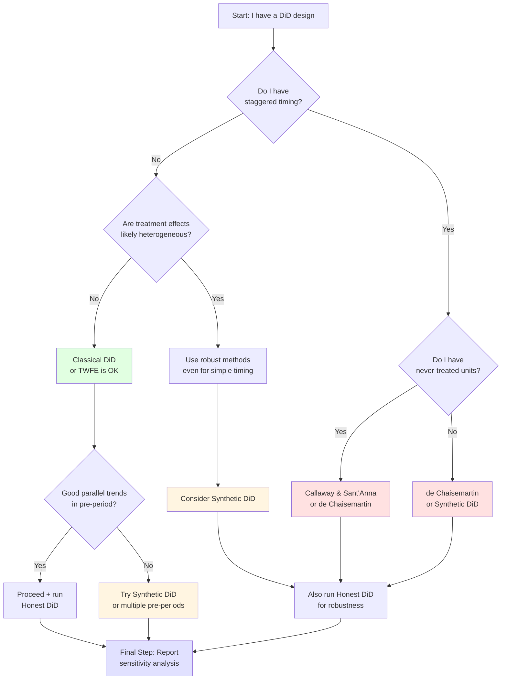

# DiD Methods Quick Reference

## Method Comparison Table

| Method | Key Paper(s) | Best Used When | Main Advantage | Main Limitation | Software |
|--------|-------------|----------------|----------------|-----------------|----------|
| **Classical DiD** | NBER t0280, t0312 | • Single treatment timing<br/>• Homogeneous effects<br/>• Clear control group | • Simple<br/>• Well understood<br/>• Easy to interpret | • Strong parallel trends<br/>• No heterogeneity<br/>• Limited to basic designs | Any regression package |
| **TWFE DiD** | Standard textbooks | • Panel data<br/>• Multiple units/times<br/>• **ONLY if effects homogeneous** | • Convenient<br/>• Standard approach | • ⚠️ **BROKEN** with heterogeneous effects!<br/>• Negative weights<br/>• Wrong signs possible | `lfe`, `fixest`, `plm` |
| **de Chaisemartin & D'Haultfœuille** | de-chaisemartin-d-haultf... | • Heterogeneous effects<br/>• Staggered timing<br/>• Want robust estimate | • No forbidden comparisons<br/>• Clean weights<br/>• Diagnostic tests | • More complex<br/>• Requires more data | `DIDmultiplegt` (R/Stata) |
| **Callaway & Sant'Anna** | Likely NBER 24963/25018 | • Staggered adoption<br/>• Event studies<br/>• Heterogeneous effects | • Group-time ATTs<br/>• Flexible aggregation<br/>• Never-treated controls | • Requires never-treated or not-yet-treated | `did` (R), `csdid` (Stata) |
| **Synthetic DiD** | arkhangelsky-et-al-2021 | • Few treated units<br/>• Rich pre-period<br/>• Questionable parallel trends | • Uses pre-trend fit<br/>• Combines SC + DiD<br/>• Often most robust | • Needs long pre-period<br/>• Regularization choices | `synthdid` (R), `sdid` (Stata) |
| **Honest DiD** | Honest Parallel Trends | • Any DiD design<br/>• Sensitivity analysis<br/>• Robustness checks | • Quantifies violations<br/>• Honest inference<br/>• Supplements any method | • Not a standalone estimator<br/>• Requires choosing violations | `HonestDiD` (R/Stata) |
| **Multiple Pre-periods** | div-class-title-using... | • Several pre-periods<br/>• Staggered adoption<br/>• Want to test trends | • Tests parallel trends<br/>• Uses pre-data well<br/>• Improves power | • Requires multiple pre-periods | Custom code |

---

## Decision Tree: Which Method Should I Use?



---

## Key Questions for Your Design

### 1. Treatment Timing

- [ ] **Single period**: All units treated at same time
- [ ] **Staggered**: Different units treated at different times
- [ ] **Never-treated**: Some units never get treated
- [ ] **Eventually-treated**: All units get it, just at different times

→ **If staggered**: AVOID standard TWFE. Use Callaway & Sant'Anna or de Chaisemartin & D'Haultfœuille

---

### 2. Treatment Effect Heterogeneity

- [ ] **Homogeneous**: Same effect for all units
- [ ] **Heterogeneous by unit**: Different units → different effects
- [ ] **Heterogeneous by time**: Effect changes over time since treatment
- [ ] **Dynamic effects**: Effect evolves after treatment

→ **If heterogeneous**: Standard TWFE is dangerous! Use modern estimators

---

### 3. Parallel Trends

- [ ] **Very credible**: Obvious natural experiment
- [ ] **Plausible**: Pre-trends look parallel
- [ ] **Questionable**: Some pre-trend differences
- [ ] **Dubious**: Clear pre-trends divergence

→ **If questionable**: Use Synthetic DiD or multiple pre-periods approach
→ **Always**: Run Honest DiD sensitivity analysis

---

### 4. Data Structure

- [ ] **Few treated units** (< 10)
- [ ] **Many treated units** (> 10)
- [ ] **Long pre-period** (> 5 periods)
- [ ] **Short pre-period** (< 5 periods)
- [ ] **Balanced panel**
- [ ] **Unbalanced panel**

→ **If few treated + long pre-period**: Synthetic DiD is excellent
→ **If many treated + staggered**: Callaway & Sant'Anna or de Chaisemartin & D'Haultfœuille

---

## Common Scenarios and Solutions

### Scenario 1: State Policy Adoption (Staggered)

**Example**: Minimum wage increases adopted by different states in different years

✅ **Use**: Callaway & Sant'Anna

- Group states by adoption year
- Compare to never-adopters or not-yet-treated
- Aggregate to overall ATT

📦 **Papers to read**: [NBER Working Paper 24963.pdf](file:///home/simon/githubRepos/DrSnow/didMethodPapers/Methodological%20papers%20on%20DiD/NBER%20Working%20Paper%2024963.pdf), [NBER Working Paper 25018.pdf](file:///home/simon/githubRepos/DrSnow/didMethodPapers/Methodological%20papers%20on%20DiD/NBER%20Working%20Paper%2025018.pdf)

---

### Scenario 2: Single Large Policy Change

**Example**: National minimum wage increase in one country vs other countries

✅ **Use**: Synthetic DiD

- Use other countries to construct synthetic control
- Combine with DiD for robustness

📦 **Papers to read**: [arkhangelsky-et-al-2021-synthetic-difference-in-differences.pdf](file:///home/simon/githubRepos/DrSnow/didMethodPapers/Methodological%20papers%20on%20DiD/arkhangelsky-et-al-2021-synthetic-difference-in-differences.pdf)

---

### Scenario 3: Firm-Level Intervention (Matched Pairs)

**Example**: Randomized intervention at firm level with panel data

✅ **Use**: Classical DiD is fine

- Randomization ensures parallel trends
- Can use simple TWFE

⚠️ **But also**: Run Honest DiD to show robustness

📦 **Papers to read**: [NBER Working Paper t0280.pdf](file:///home/simon/githubRepos/DrSnow/didMethodPapers/Methodological%20papers%20on%20DiD/NBER%20Working%20Paper%20t0280.pdf), [Honest Parallel Trends July 2021.pdf](file:///home/simon/githubRepos/DrSnow/didMethodPapers/Methodological%20papers%20on%20DiD/Honest%20Parallel%20Trends%20July%202021.pdf)

---

### Scenario 4: Event Study with Uncertain Timing

**Example**: Merger announcements, policy debates

✅ **Use**: Multiple pre-treatment periods approach

- Explicitly model anticipation
- Test for pre-trends rigorously

📦 **Papers to read**: [div-class-title-using-multiple-pretreatment-periods...](file:///home/simon/githubRepos/DrSnow/didMethodPapers/Methodological%20papers%20on%20DiD/div-class-title-using-multiple-pretreatment-periods-to-improve-difference-in-differences-and-staggered-adoption-designs-div.pdf)

---

## Red Flags: When Your DiD is in Trouble

### 🚨 Red Flag 1: Pre-trends Don't Look Parallel

**Symptom**: Event study shows treatment/control diverging before treatment

**Solutions**:

1. Use Synthetic DiD to better match pre-trends
2. Run Honest DiD to quantify sensitivity
3. Consider multiple pre-periods approach
4. Re-think identification strategy

---

### 🚨 Red Flag 2: You Have Staggered Timing + Used TWFE

**Symptom**: Standard `reg y post*treat i.unit i.time` with staggered adoption

**Why bad**: Likely comparing already-treated to newly-treated (forbidden!)

**Solutions**:

1. Use Callaway & Sant'Anna estimator
2. Use de Chaisemartin & D'Haultfœuille
3. Event study to decompose effects
4. Report decomposition weights

📦 **Must read**: [de-chaisemartin-d-haultf_C5_93uille-2020...](file:///home/simon/githubRepos/DrSnow/didMethodPapers/Methodological%20papers%20on%20DiD/de-chaisemartin-d-haultf_C5_93uille-2020-two-way-fixed-effects-estimators-with-heterogeneous-treatment-effects.pdf)

---

### 🚨 Red Flag 3: You Have Few Controls

**Symptom**: Only 3-5 control units

**Why bad**: Standard DiD assumes many controls for asymptotic theory

**Solutions**:

1. Use Synthetic DiD with regularization
2. Consider permutation tests
3. Wild bootstrap for inference
4. Be very careful with overfitting

---

### 🚨 Red Flag 4: Your ATT Sign Flips Across Specifications

**Symptom**: Sometimes positive, sometimes negative depending on spec

**Why bad**: Suggests negative weights problem or specification sensitivity

**Solutions**:

1. Check for heterogeneous effects
2. Decompose TWFE into clean comparisons
3. Use robust estimators
4. Report honest bounds

---

## Estimation Checklist

Before publishing your DiD results, check:

### Pre-Analysis

- [ ] Clearly defined treatment and control groups
- [ ] Specified treatment timing
- [ ] Checked for sample balance
- [ ] Verified no anticipation effects
- [ ] Examined outcome trends before treatment

### Estimation

- [ ] Chose appropriate estimator (not blindly TWFE!)
- [ ] Clustered standard errors appropriately
- [ ] Created event study plot
- [ ] Tested for pre-trends
- [ ] Checked for heterogeneous effects

### Robustness

- [ ] Run Honest DiD sensitivity
- [ ] Try alternative estimators
- [ ] Test different control groups
- [ ] Vary sample restrictions
- [ ] Placebo tests (false treatment dates)

### Reporting

- [ ] Event study graph
- [ ] Pre-trend test results
- [ ] Sensitivity bounds
- [ ] Weights diagnostics (if using TWFE)
- [ ] Software packages cited

---

## Software Quick Start

### R

```r
# Callaway & Sant'Anna
library(did)
result <- att_gt(yname = "outcome",
                 tname = "year",
                 idname = "unit",
                 gname = "first_treat",
                 data = panel_data)

# de Chaisemartin & D'Haultfœuille
library(DIDmultiplegt)
result <- did_multiplegt(df = panel_data,
                         Y = "outcome",
                         G = "unit",
                         T = "year",
                         D = "treatment")

# Synthetic DiD
library(synthdid)
result <- synthdid_estimate(Y ~ treatment, data)

# Honest DiD
library(HonestDiD)
honest_did(result, sensitivity_params)
```

### Stata

```stata
* Callaway & Sant'Anna
csdid outcome, ivar(unit) time(year) gvar(first_treat)

* de Chaisemartin & D'Haultfœuille  
did_multiplegt outcome unit year treatment

* Synthetic DiD
sdid outcome unit year treatment

* Honest DiD
honestdid, pre(pre_coefs) post(post_coefs)
```

### Python

```python
# pyfixest (TWFE with caution!)
from pyfixest import feols
result = feols('outcome ~ treatment | unit + year', data=df)

# Custom implementations needed for newer methods
# Or call R from Python using rpy2
```

---

## Further Resources

### Online Resources

- **[DiD Reading Group](https://www.nber.org/econometrics_minicourse_2019)**: NBER lectures
- **Mixtape Sessions**: Scott Cunningham's DiD course
- **World Bank DiD Guide**: Practical implementation guide

### Key Authors to Follow

- **Clément de Chaisemartin** (Sciences Po)
- **Xavier D'Haultfœuille** (CREST)
- **Pedro Sant'Anna** (Emory)
- **Brantly Callaway** (UGA)  
- **Susan Athey** (Stanford)
- **Guido Imbens** (Stanford)
- **Alberto Abadie** (MIT)

---

## Your Next Steps

1. **Read the "Big 3"**:
   - ✅ de Chaisemartin & D'Haultfœuille (understand the problem)
   - ✅ Synthetic DiD (learn a robust solution)
   - ✅ Honest Parallel Trends (test your assumptions)

2. **Try an Estimator**:
   - Install software packages
   - Replicate examples from papers
   - Apply to your data

3. **Stay Updated**:
   - Recent NBER papers (w33026, w32117, etc.)
   - arXiv papers for statistical innovations
   - Check package updates regularly

---

## Summary

**The Revolution**: DiD methods have fundamentally changed in the past 5 years. What we thought was safe (TWFE) can be dangerous.

**The Bottom Line**:

- ⚠️ **Don't blindly use TWFE** with staggered timing
- ✅ **Use modern estimators** designed for heterogeneity
- 🔍 **Always test assumptions** with Honest DiD and pre-trends
- 📊 **Report robustly** with sensitivity analysis

**Your collection gives you everything you need** to understand and implement modern DiD methods correctly!
