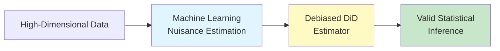

# Cutting-Edge Difference-in-Differences Literature (2024-2025)

## Executive Summary

The Difference-in-Differences (DiD) methodology has undergone rapid transformation in 2024-2025, primarily driven by the need to address **heterogeneous treatment effects** and **staggered adoption** designs. Traditional two-way fixed effects (TWFE) estimators have been shown to produce biased results in these complex scenarios, leading to the development of robust alternative methods.

---

## Key Methodological Advances

### 1. Heterogeneity-Robust DiD Estimators

> [!IMPORTANT]
> Traditional TWFE regressions can produce **biased estimates** when treatment effects vary across groups or over time, especially in staggered adoption settings.

**The Problem:**

- Treatment effects often vary across different units (heterogeneity)
- Different units receive treatment at different times (staggered adoption)
- TWFE implicitly uses already-treated units as controls, creating "forbidden comparisons"
- Can produce estimates with the **wrong sign** compared to the true effect

**Leading Solutions:**

#### **Callaway & Sant'Anna (2021)** - Group-Time Average Treatment Effects

- **Key Innovation:** Estimates treatment effects for specific cohorts at specific times
- **Implementation:** Available in R package `did`
- **Recent Updates (2024):**
  - Extension to **continuous treatments** (NBER WP 32117, 2024)
  - Addressing conditional parallel trends with covariates
  - Identification of "hidden linearity bias" in TWFE regressions

#### **Borusyak, Jaravel & Spiess (2024)** - Imputation Estimator

- **Key Innovation:** Imputes counterfactual outcomes for treated units using untreated observations
- **Published:** Review of Economic Studies, November 2024
- **Implementation:** `did_imputation` commands in Stata and R
- **Advantages:**
  - Efficient when treatment-effect heterogeneity is unrestricted
  - Provides tools for testing parallel trends assumption
  - Robust to heterogeneous effects

---

### 2. Staggered Difference-in-Differences

**Core Challenge:** When treatment is implemented at different times for different units, traditional DiD methods break down.

**Key Developments (2024):**

| Method | Authors | Key Feature |
|--------|---------|-------------|
| **Callaway-Sant'Anna** | Callaway & Sant'Anna | Group-time ATT estimation |
| **Borusyak-Jaravel-Spiess** | Borusyak et al. | Imputation-based approach |
| **Sun & Abraham** | Sun & Abraham | Event-study coefficients |
| **Gardner** | Gardner | Two-stage estimation |

**Practical Guidance:**

- "Advances in Difference-in-differences Methods for Policy Evaluation Research" (*Epidemiology*, September 2024)
- "Difference-in-Differences Designs: A Practitioner's Guide" (Baker, Callaway, Cunningham, Goodman-Bacon, Sant'Anna - revised June 2025)

---

### 3. Synthetic Control Integration

**Synthetic Difference-in-Differences (SDID)** combines the strengths of both approaches:

> [!TIP]
> SDID constructs a synthetic control group that matches pre-treatment trends, then applies before-after comparison like traditional DiD.

**Key Paper:**

- Arkhangelsky, Athey, Hirshberg, Imbens & Wager - "Synthetic Difference-in-Differences" (AER, 2021)

**Recent Advances (2024-2025):**

1. **Doubly Robust DiD + Synthetic Control**
   - Paper: "Difference-in-Differences Meets Synthetic Control: Doubly Robust Identification and Estimation" (Sun, Xie, Zhang - expected March 2025)
   - **Innovation:** Consistent estimates if EITHER parallel trends OR synthetic control assumption holds
   - Uses multiplier bootstrap for valid inference

2. **Extensions:**
   - Accounting for **interference** between units (2024)
   - Handling **short pre-treatment periods**
   - Evaluating **multiple outcomes** simultaneously
   - Application to **microeconomic panel data** (individual-level)

---

### 4. Machine Learning Integration

**Double Machine Learning for DiD (DML-DiD):**

**Key Innovations (2024):**

- **Handling Continuous Treatments:** DML-DiD extended to scenarios where treatment intensity varies (arXiv 2024)
- **Heterogeneous Treatment Effects:** Machine Learning DiD (MLDID) estimates time-varying conditional ATT
- **Software Tools:** EconML, CausalML libraries now widely available

**Advantages:**

- Manages high-dimensional confounding
- Captures non-linear relationships
- Robust to model misspecification via cross-fitting

**Applications:**

- Random Forests and Neural Networks for outcome prediction
- Causal Forests for heterogeneity analysis
- Double/Debiased ML for valid inference under complex confounding

---

### 5. Double Robust Estimation

**Core Principle:** Estimator remains consistent if **either** propensity score model OR outcome regression model is correctly specified (but not necessarily both).

**Recent Developments (2024-2025):**

#### **Enhanced Double Robust Estimators**

- Nonparametric concave/convex link functions (Zhang et al., March 2024)
- **Multiply robust** approaches (consistent even if only subset of models correct)
- Bayesian doubly robust methods (June 2025)

#### **DiD-Specific Applications**

- **DiD Bayesian Causal Forest (DiD-BCF):** Non-parametric model for staggered adoption with heterogeneous effects (arXiv 2024)
- **Efficient DiD Estimators:** Semiparametrically efficient with inherent double robustness (Sant'Anna et al., expected June 2025)

#### **Integration with Synthetic Control**

- Doubly robust under EITHER parallel trends OR synthetic control assumption
- Particularly valuable for short panels

---

## Foundational Issues Addressed

### Parallel Trends Assumption

Traditional DiD requires that treated and control groups would have experienced the same average change in outcomes absent treatment.

**Modern Approaches:**

1. **Conditional Parallel Trends**
   - Caetano & Callaway (2024): "Difference-in-Differences when Parallel Trends Holds Conditional on Covariates"
   - Identifies "hidden linearity bias" in TWFE regressions
   - Proposes alternative estimation strategies

2. **Relaxing Parallel Trends**
   - Synthetic control methods provide alternative identification
   - Doubly robust methods allow for violations if other assumptions hold
   - Pre-trend testing and sensitivity analysis now standard

### Treatment Effect Heterogeneity

> [!WARNING]
> TWFE can produce **negatively weighted** treatment effects, giving more weight to certain comparisons that may not represent the estimand of interest.

**Solutions:**

- Decomposition methods (Goodman-Bacon)
- Explicit targeting of specific estimands (group-time ATT, event-study coefficients)
- Machine learning for heterogeneity exploration

---

## Key Authors and Institutions

### Leading Researchers

| Author | Institution | Key Contribution |
|--------|-------------|------------------|
| **Pedro Sant'Anna** | Emory University | Doubly robust DiD, DML-DiD, modern DiD methods |
| **Brantly Callaway** | University of Georgia | Group-time ATT, continuous treatments |
| **Kirill Borusyak** | UCL | Imputation estimator for event studies |
| **Xavier Jaravel** | LSE | Event study designs |
| **Susan Athey** | Stanford | Synthetic DiD, causal ML |
| **Clément de Chaisemartin** | Sciences Po | TWFE heterogeneity critique |

### Recent Presentations (2024)

- **Pedro Sant'Anna:** "Modern Difference-in-Differences" (NABE TEC, October 2024)
- **Oxford Talk:** "Recent Advances in DiD" (scheduled June 2025)
- **Georgetown Center:** "Difference-in-Differences for Panel Data" course (Spring 2024)

---

## Software Implementations

### R Packages

- `did` - Callaway & Sant'Anna methods
- `did_imputation` - Borusyak-Jaravel-Spiess estimator
- `synthdid` - Synthetic DiD (Arkhangelsky et al.)
- `fixest` - Fast fixed effects with robust DiD

### Stata

- `did_imputation` - Imputation estimator
- `csdid` - Callaway-Sant'Anna DiD
- `eventstudyinteract` - Sun & Abraham

### Python

- `EconML` - Microsoft's causal ML library
- `CausalML` - Uber's causal inference library
- DiD-specific implementations in development

---

## Applications and Empirical Trends

**Fields Actively Using Modern DiD (2024):**

1. **Public Health** - Policy evaluation research
2. **Labor Economics** - Minimum wage studies
3. **Finance** - Stock market policy effects
4. **Environmental Economics** - Climate policy evaluation
5. **Development Economics** - Program evaluation

**Common Scenarios:**

- Staggered policy rollouts across states/regions
- Corporate policy adoption at different times
- Sequential treatment in education interventions
- Healthcare policy changes with varied implementation dates

---

## Practical Recommendations

### For Applied Researchers

> [!IMPORTANT]
> **Do NOT use standard TWFE regressions** with staggered adoption unless you verify treatment effects are homogeneous (Goodman-Bacon decomposition).

**Step-by-Step Approach:**

1. **Diagnostic Phase**
   - Check for staggered adoption
   - Test for pre-trends
   - Examine treatment effect heterogeneity

2. **Method Selection**
   - **Simple 2×2 DiD:** Traditional methods acceptable
   - **Staggered adoption + homogeneous effects:** Bacon decomposition sufficient
   - **Staggered adoption + heterogeneous effects:** Use Callaway-Sant'Anna or Borusyak-Jaravel-Spiess
   - **Short panels:** Consider synthetic control or doubly robust methods
   - **High-dimensional confounding:** DML-DiD

3. **Robustness Checks**
   - Multiple estimators comparison
   - Sensitivity to parallel trends violations
   - Placebo tests
   - Pre-trend analysis

---

## Emerging Topics (2024-2025)

### Sequential Synthetic Control DiD

- Addresses staggered timing AND heterogeneity
- Efficiency guarantees under development

### Triple Differences

- "Better Understanding Triple Differences Estimators" (Sant'Anna, expected May 2025)
- Adds third dimension of comparison

### Continuous Treatments

- "Difference-in-differences with a Continuous Treatment" (Callaway, Goodman-Bacon, Sant'Anna, NBER 2024)
- Event studies with continuous treatment intensity

### Instrumental Variables Integration

- DID-IV under staggered adoption (Miyaji, 2024)
- Addresses endogenous treatment timing

---

## Key Papers in Your Local Collection

Based on the files in `/home/simon/githubRepos/DrSnow/didMethodPapers/Methodological papers on DiD/`:

### Foundational Papers (Already Collected)

1. **Synthetic DiD:**
   - `arkhangelsky-et-al-2021-synthetic-difference-in-differences.pdf`

2. **TWFE Heterogeneity Critique:**
   - `de-chaisemartin-d-haultf_C5_93uille-2020-two-way-fixed-effects-estimators-with-heterogeneous-treatment-effects.pdf`

3. **Multiple Pretreatment Periods:**
   - `div-class-title-using-multiple-pretreatment-periods-to-improve-difference-in-differences-and-staggered-adoption-designs-div.pdf`

4. **Recent NBER Working Papers:**
   - `NBER Working Paper w32117.pdf` - Likely continuous treatment DiD (Callaway et al., 2024)
   - `NBER Working Paper w33026.pdf` - Recent 2024 paper
   - Various other methodological papers (29691, 30564, 31063, 31842, etc.)

5. **Journal Articles:**
   - `1-s2.0-S0304407620303948-main.pdf` - Journal of Econometrics
   - `rdae007.pdf` - Likely Review of Economics publication

---

## Recommended Next Steps

### For Understanding the Literature

1. **Start with overview papers:**
   - Baker et al. "Difference-in-Differences Designs: A Practitioner's Guide" (2025)
   - Roth et al. "What's Trending in Difference-in-Differences" (Annual Review)

2. **Core methodological papers:**
   - Callaway & Sant'Anna (2021) - JoE
   - Borusyak, Jaravel & Spiess (2024) - RES
   - De Chaisemartin & D'Haultfœuille (2020) - AER

3. **Recent extensions (2024-2025):**
   - Continuous treatments (Callaway et al., NBER 32117)
   - Conditional parallel trends (Caetano & Callaway, 2024)
   - DiD meets synthetic control (Sun et al., 2025)

### For Implementation

1. **Install key R packages:** `did`, `did_imputation`, `synthdid`, `fixest`
2. **Review software vignettes** for practical examples
3. **Replicate published applications** to understand methods in practice

### For Your Research

1. **Identify your design:**
   - Simple vs. staggered adoption?
   - Homogeneous vs. heterogeneous effects?
   - Panel vs. repeated cross-sections?

2. **Select appropriate estimator** based on design features
3. **Conduct robustness checks** across multiple methods
4. **Report transparently** on method choice and sensitivity

---

## References and Resources

### Key URLs

- **Pedro Sant'Anna's website:** [psantanna.com](https://psantanna.com) - Slides, code, working papers
- **DiD Digest:** [diddigest.xyz](https://diddigest.xyz) - Curated collection of DiD research
- **NBER DiD Papers:** Search "difference-in-differences" on nber.org

### Recent Survey Papers

- *Epidemiology* (September 2024): "Advances in Difference-in-differences Methods for Policy Evaluation Research"
- *Annual Review of Public Health* (2024): Practical guide to modern DiD estimators

### Software Documentation

- R `did` package: [bcallaway11.github.io/did](https://bcallaway11.github.io/did)
- `did_imputation`: Documentation on CRAN and GitHub

---

## Summary of Key Takeaways

1. **TWFE is broken** for staggered DiD with heterogeneous effects
2. **Multiple robust alternatives** now available (Callaway-Sant'Anna, Borusyak-Jaravel-Spiess, etc.)
3. **Combination methods** (DiD + Synthetic Control) provide double robustness
4. **Machine learning integration** handles high-dimensional confounding
5. **Software implementations** make modern methods accessible
6. **2024-2025 continues rapid innovation** in the field

> [!CAUTION]
> If using DiD in your research, ensure you're using appropriate modern methods. Reviewers are increasingly rejecting papers using standard TWFE in staggered settings.
